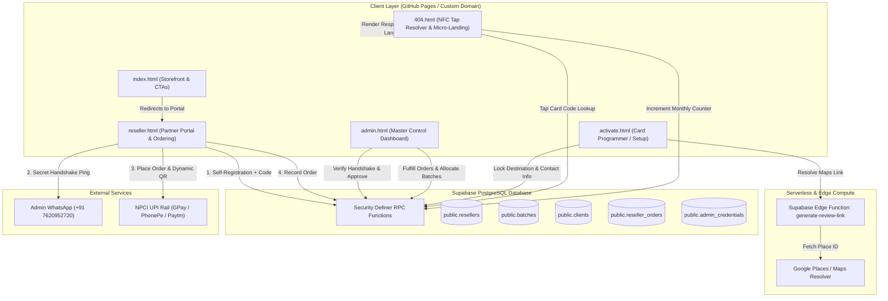
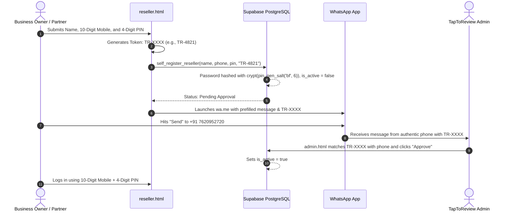
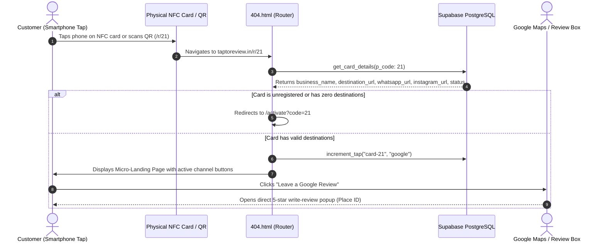

# TapToReview.in — Platform Architecture & Documentation

TapToReview is an NFC and QR-enabled review automation and physical counter-display platform for commercial businesses in India. It converts customer walk-ins into Google Reviews, WhatsApp leads, and Instagram followers without mobile apps, typing, or search friction.

---

## 1. System Architecture

The following diagram illustrates how the static frontend on GitHub Pages, Cloudflare edge routing, Supabase PostgreSQL with RPC security definers, and WhatsApp verification work together:



---

## 2. Core User & Operational Journeys

### A. Customer Self-Registration & Secret Handshake (Zero-SMS OTP)



---

### B. Hardware Card Tap & Routing Flow



---

## 3. Database Schema

### Table Definitions

| Table Name | Description | Key Columns |
| --- | --- | --- |
| `public.resellers` | Stores partners and approved client accounts. | `id` (UUID), `name` (TEXT UNIQUE), `phone` (TEXT), `password_hash` (TEXT), `is_active` (BOOL), `verification_code` (TEXT), `created_at` (TIMESTAMPTZ) |
| `public.batches` | Allocates continuous ranges of physical card numbers to partners. | `id` (UUID), `reseller_name` (TEXT), `range_start` (INT), `range_end` (INT), `is_active` (BOOL), `created_at` (TIMESTAMPTZ) |
| `public.clients` | Stores configuration and dynamic destinations for individual cards. | `id` (UUID), `card_code` (INT UNIQUE), `slug` (TEXT), `platform` (TEXT), `business_name` (TEXT), `city_location` (TEXT), `category` (enum: `business_category`), `destination_url` (TEXT NULL), `whatsapp_url` (TEXT NULL), `instagram_url` (TEXT NULL), `status` (TEXT), `tap_count` (INT) |
| `public.reseller_orders` | Tracks card inventory restock requests and direct client orders. | `id` (UUID), `reseller_id` (UUID), `reseller_name` (TEXT), `card_quantity` (INT), `total_amount` (INT), `status` (TEXT: `pending`/`fulfilled`/`cancelled`), `notes` (TEXT), `created_at` (TIMESTAMPTZ) |
| `public.admin_credentials` | Stores the master administrative dashboard password hash. | `id` (INT PRIMARY KEY = 1), `password_hash` (TEXT), `updated_at` (TIMESTAMPTZ) |

### Enums & Types

```sql
CREATE TYPE public.business_category AS ENUM (
  'Restaurant & Cafe',
  'Salon & Spa',
  'Healthcare & Clinic',
  'Retail & Shopping',
  'Professional Services',
  'Auto & Garage',
  'Fitness & Sports',
  'Other'
);

```

---

## 4. Supabase RPC Function Reference

All functions operate as `SECURITY DEFINER` to bypass public client privileges and enforce database-level validation.

```
┌────────────────────────────────────────────────────────────────────────────────┐
│                           SECURITY DEFINER RPC MAP                             │
├──────────────────────────┬─────────────────────────────────────────────────────┤
│ self_register_reseller   │ Hashes 4-digit PIN, stores TR-XXXX code as pending. │
│ reseller_get_portal      │ Authenticates phone/name + PIN; returns inventory.  │
│ reseller_create_order    │ Records orders with calculated quantity and amount. │
├──────────────────────────┼─────────────────────────────────────────────────────┤
│ admin_get_overview       │ Master dashboard data (approvals, orders, batches). │
│ admin_approve_reseller   │ Approves or deletes pending registrations.          │
│ admin_assign_batch       │ Maps card ranges (#1-#20) to a reseller partner.    │
│ admin_update_order_status│ Marks orders fulfilled or cancelled.                │
├──────────────────────────┼─────────────────────────────────────────────────────┤
│ verify_and_get_card      │ Checks reseller batch ownership to unlock card setup│
│ register_card            │ Upserts card destination, category, and socials.    │
│ deregister_card          │ Wipes card configuration back to 'unregistered'.    │
│ get_card_details         │ Read-only tap resolver for 404.html.                │
│ increment_tap            │ Increments tap analytics counter for leaderboards.  │
└──────────────────────────┴─────────────────────────────────────────────────────┘

```

### Complete Database Functions SQL

```sql
-- 1. Self-Registration Function with Secret Handshake Code
CREATE OR REPLACE FUNCTION public.self_register_reseller(
  p_name text,
  p_phone text,
  p_pin text,
  p_code text
)
RETURNS json
LANGUAGE plpgsql
SECURITY DEFINER
AS $$
DECLARE
  v_clean_phone text;
BEGIN
  IF NOT (trim(p_pin) ~ '^\d{4}$') THEN
    RETURN json_build_object('success', false, 'message', 'PIN must be exactly 4 digits');
  END IF;

  v_clean_phone := regexp_replace(trim(p_phone), '\D', '', 'g');
  IF length(v_clean_phone) >= 10 THEN
    v_clean_phone := right(v_clean_phone, 10);
  ELSE
    RETURN json_build_object('success', false, 'message', 'Please enter a valid 10-digit mobile number');
  END IF;

  IF EXISTS (
    SELECT 1 FROM public.resellers 
    WHERE right(regexp_replace(COALESCE(phone, ''), '\D', '', 'g'), 10) = v_clean_phone
  ) THEN
    RETURN json_build_object('success', false, 'message', 'This mobile number is already registered.');
  END IF;

  IF EXISTS (
    SELECT 1 FROM public.resellers 
    WHERE lower(trim(name)) = lower(trim(p_name))
  ) THEN
    RETURN json_build_object('success', false, 'message', 'This business/partner name is already registered.');
  END IF;

  INSERT INTO public.resellers (name, phone, password_hash, is_active, verification_code)
  VALUES (
    trim(p_name),
    v_clean_phone,
    crypt(trim(p_pin), gen_salt('bf', 6)),
    false,
    trim(p_code)
  );

  RETURN json_build_object('success', true, 'message', 'Registration submitted successfully.');
END;
$$;

-- 2. Partner Portal Authentication & Dashboard Data Fetch
CREATE OR REPLACE FUNCTION public.reseller_get_portal(
  p_identifier text,
  p_password text
)
RETURNS json
LANGUAGE plpgsql
SECURITY DEFINER
AS $$
DECLARE
  v_reseller record;
  v_batches json;
  v_orders json;
  v_clean_phone text;
BEGIN
  v_clean_phone := regexp_replace(trim(p_identifier), '\D', '', 'g');
  IF length(v_clean_phone) >= 10 THEN
    v_clean_phone := right(v_clean_phone, 10);
  END IF;

  SELECT id, name, phone, is_active INTO v_reseller
  FROM public.resellers
  WHERE (
    lower(trim(name)) = lower(trim(p_identifier))
    OR (v_clean_phone <> '' AND right(regexp_replace(COALESCE(phone, ''), '\D', '', 'g'), 10) = v_clean_phone)
  )
  AND password_hash = crypt(trim(p_password), password_hash)
  LIMIT 1;

  IF NOT FOUND THEN
    RETURN json_build_object('success', false, 'message', 'Invalid mobile number, name, or 4-digit PIN');
  END IF;

  IF NOT v_reseller.is_active THEN
    RETURN json_build_object('success', false, 'message', 'Your account is pending admin approval.');
  END IF;

  SELECT json_agg(b ORDER BY b.range_start ASC) INTO v_batches
  FROM (
    SELECT id, range_start, range_end, is_active
    FROM public.batches
    WHERE reseller_name = v_reseller.name AND is_active = true
  ) b;

  SELECT json_agg(o ORDER BY o.created_at DESC) INTO v_orders
  FROM (
    SELECT id, card_quantity, total_amount, status, notes, created_at
    FROM public.reseller_orders
    WHERE reseller_id = v_reseller.id
    ORDER BY created_at DESC
    LIMIT 25
  ) o;

  RETURN json_build_object(
    'success', true,
    'reseller', json_build_object('id', v_reseller.id, 'name', v_reseller.name, 'phone', v_reseller.phone),
    'batches', COALESCE(v_batches, '[]'::json),
    'orders', COALESCE(v_orders, '[]'::json)
  );
END;
$$;

-- 3. Card Configuration & Authorization RPC
CREATE OR REPLACE FUNCTION public.verify_and_get_card(
  p_code integer,
  p_password text
)
RETURNS json
LANGUAGE plpgsql
SECURITY DEFINER
AS $$
DECLARE
  v_batch record;
  v_client record;
  v_auth boolean := false;
BEGIN
  SELECT b.*, r.password_hash AS r_password_hash, r.is_active AS r_is_active
  INTO v_batch 
  FROM public.batches b
  LEFT JOIN public.resellers r ON r.name = b.reseller_name
  WHERE p_code BETWEEN b.range_start AND b.range_end 
    AND b.is_active = true
  LIMIT 1;

  IF NOT FOUND THEN
    RETURN json_build_object('success', false, 'message', 'Card code not in any active batch');
  END IF;

  IF v_batch.r_password_hash IS NOT NULL AND (v_batch.r_is_active IS NULL OR v_batch.r_is_active = true) THEN
    IF v_batch.r_password_hash = crypt(trim(p_password), v_batch.r_password_hash) THEN
      v_auth := true;
    END IF;
  ELSIF v_batch.password_hash IS NOT NULL THEN
    IF v_batch.password_hash = crypt(trim(p_password), v_batch.password_hash) THEN
      v_auth := true;
    END IF;
  END IF;

  IF NOT v_auth THEN
    RETURN json_build_object('success', false, 'message', 'Invalid PIN for this card');
  END IF;

  SELECT * INTO v_client FROM public.clients WHERE card_code = p_code LIMIT 1;

  IF NOT FOUND OR v_client.status = 'unregistered' THEN
    RETURN json_build_object(
      'success', true,
      'status', 'unregistered',
      'card_code', p_code,
      'batch_reseller', v_batch.reseller_name
    );
  END IF;

  RETURN json_build_object(
    'success', true,
    'status', v_client.status,
    'card_code', v_client.card_code,
    'business_name', v_client.business_name,
    'city_location', v_client.city_location,
    'category', v_client.category,
    'destination_url', v_client.destination_url,
    'whatsapp_url', v_client.whatsapp_url,
    'instagram_url', v_client.instagram_url
  );
END;
$$;

```

---

## 5. Frontend Application Architecture

### Static File Structure

```
├── index.html                 # Brand storefront, stats, benefits, leaderboard, order CTA
├── reseller.html              # Customer & Partner Portal (Sign in, Sign up, Pricing, UPI QR)
├── activate.html              # Secure card setup interface for programming NFC chips
├── 404.html                   # Dynamic router for /r/:id and branded micro-landing page
├── assets/                    # SVG logos, PVC product previews, counter stand mockups
└── css/
    └── styles.css             # Unified dark glassmorphism design system

```

### Page Interaction Matrix

| File | Primary Users | Key Functions | Upstream Supabase RPC |
| --- | --- | --- | --- |
| `index.html` | Visitors / Prospective Clients | Value proposition, interactive tap counter, monthly leaderboard, direct link to portal. | `get_monthly_leaderboard` |
| `reseller.html` | Verified Clients & Resellers | 4-digit PIN registration, secret code handshake, inventory monitor, auto-calculated pack orders, instant UPI QR generation. | `self_register_reseller`, `reseller_get_portal`, `reseller_create_order` |
| `activate.html` | Card Installers & Resellers | Validates batch PIN, invokes Edge Function for direct 5-star Google Place ID URLs, writes Instagram/WhatsApp endpoints, resets cards. | `verify_and_get_card`, `register_card`, `deregister_card`, Edge: `generate-review-link` |
| `admin.html` | Platform Owner | Verifies handshake codes, approves/rejects signups, fulfills orders, assigns card numeric ranges (`#1–#50`). | `admin_get_overview`, `admin_approve_reseller`, `admin_assign_batch`, `admin_update_order_status` |
| `404.html` | End Consumers (Tapping Phone) | Resolves `/r/{code}` path, tracks analytics tap count, displays micro-landing page or redirects unconfigured cards to setup. | `get_card_details`, `increment_tap` |

---

## 6. Commercial Pricing Engine

The portal uses strict quantity enforcement with volume-tiered unit economics configured in `reseller.html`:

| Pack Type | Quantity | Unit Price | Total Payable | UPI Auto-Calculation |
| --- | --- | --- | --- | --- |
| **Single Card** | 1 | ₹350 | **₹350** | `upi://pay?pa=7620952720@ybl&am=350&tn=TapToReview` |
| **Starter Pack** | 5 | ₹270 | **₹1,350** | `upi://pay?pa=7620952720@ybl&am=1350&tn=TapToReview` |
| **Pro Pack** | 10 | ₹240 | **₹2,400** | `upi://pay?pa=7620952720@ybl&am=2400&tn=TapToReview` |
| **Growth Pack** | 20 | ₹220 | **₹4,400** | `upi://pay?pa=7620952720@ybl&am=4400&tn=TapToReview` |
| **Agency Pack** | 50 | ₹190 | **₹9,500** | `upi://pay?pa=7620952720@ybl&am=9500&tn=TapToReview` |

---

## 7. Edge Function: Google Review URL Transformation

Standard Google Maps links (`[https://maps.app.goo.gl/](https://maps.app.goo.gl/)...`) navigate users to an informational business overview page where reviews are buried.

When saved in `activate.html`, the Supabase Edge Function `generate-review-link` follows the redirects, extracts the business `placeid`, and resolves it to a direct write-review box:

```text
Input:  https://maps.app.goo.gl/abC123XyZ
Output: https://search.google.com/local/writereview?placeid=ChIJN1t_tDeuEmsRUsoyG83frY4

```

If an error occurs or the client does not possess a Google Business Profile, `activate.html` skips the Edge Function and allows saving WhatsApp and Instagram links alone.

---

## 8. Deployment & Environment Setup

### GitHub Pages Configuration

* **Target Branch:** `database-creation` (or `main`)
* **Custom Domain:** `taptoreview.in`
* **HTTPS Enforcement:** Enabled via Cloudflare / GitHub Pages SSL

### Production Client Configuration

Static assets interact with Supabase using the persistent client credentials embedded across the frontend templates:

* **Supabase URL:** `[https://zavspmqjmrinfxenbosz.supabase.co](https://zavspmqjmrinfxenbosz.supabase.co)`
* **Admin Contact & UPI Recipient:** `+91 7620952720` (`7620952720@ybl`)
